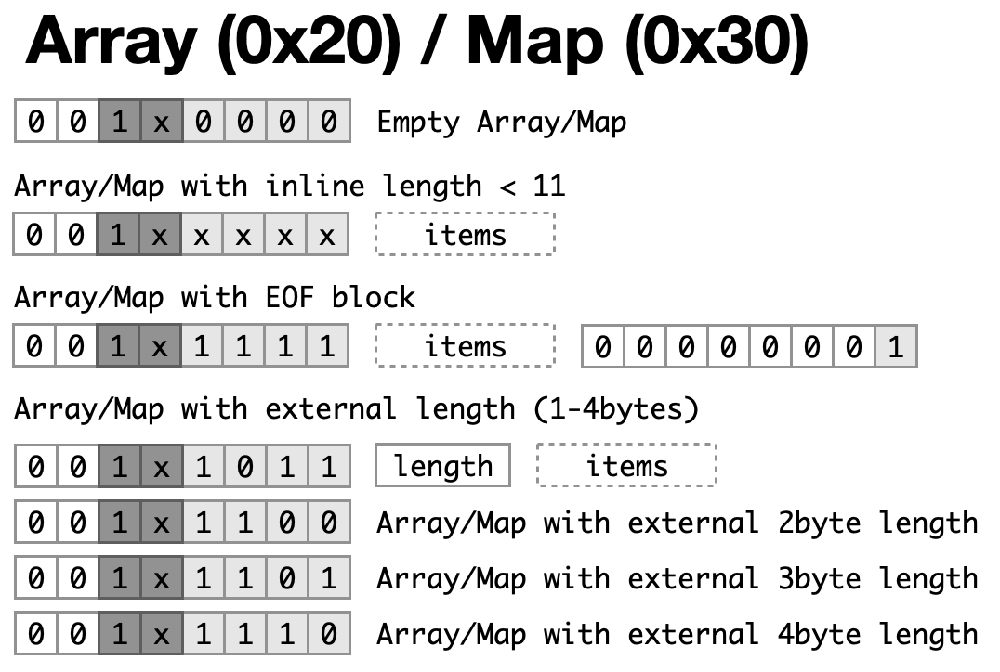

# YAJBE Specs - Yet Another JSON Binary Encoding


As many other binary formats YAJBE is using an "header byte" to identify the type of the encoded data, followed by the data itself.

The layout of the header is not "fixed" as many other encoding, the choice we made was to be able to save a bit more space on small strings/bytes.

The decode loop will look something like this:

```java
final int head = stream.read();
if ((head & 0b11_000000) == 0b11_000000) {
  // decode string
} else if ((head & 0b10_000000) == 0b10_000000) {
  // decode bytes
} else if ((head & 0b010_00000) == 0b010_00000) {
  // decode int
} else if ((head & 0b0011_0000) == 0b0011_0000) {
  // decode map
} else if ((head & 0b0010_0000) == 0b0010_0000) {
  // decode array
} else if ((head & 0b000001_00) == 0b000001_00) {
  // decode float
} else return switch (head) {
  case 0b00000000 -> /* null */;
  case 0b00000001 -> /* EOF (end of array/map) */;
  case 0b00000010 -> /* false */;
  case 0b00000011 -> /* true */;
  default -> throw new IOException("unsupported");
};
```

## Integers


There is a separation between Unsigned and Signed Integer. From the header you can identify an unsigned by the 0x40 mask and the signed by the 0x60 mask.

Values between -23 and 24 (included) will be inlined in the header, consuming a single byte.
0 is encoded as a signed value (0x60).

 * If the value is below -23 the value will be stored without sign as ((-v) - 24)
 * If the value is above 24, the value will be stored as (v - 25)

The required amount of bytes will be calculated. (e.g. v <= 255 requires 1byte, v <= 65535 requires 2bytes and so on).

The number of bytes required to represent the value will be stored in the header. The values between 24 and 31 are reserved just for that. so we can encode them as (23 + numberOfBytes).

Then the value will be encoded as Nbytes in little-endian order. if the value is negative will be written as positive (-value).

_Note that the encoding support 64bits but Java support only 63bits and javascript has the max safe value a 53bits. so for each language there may be a special type conversion to adjust to the language limitations._

## Floats

Floats can be stored in 2bytes, 4bytes or 8bytes. The header will be 4, 5 or 6 to identify the float size.

For float32 and float64, the encoding of the specified floating-point value is following the IEEE 754 floating-point "single format" bit layout, preserving Not-a-Number (NaN) values.

#### Float32
Bit 31 (the bit that is selected by the mask 0x80000000) represents the sign of the floating-point number. Bits 30-23 (the bits that are selected by the mask 0x7f800000) represent the exponent. Bits 22-0 (the bits that are selected by the mask 0x007fffff) represent the significand (sometimes called the mantissa) of the floating-point number.

If the argument is positive infinity, the result is 0x7f800000. \
If the argument is negative infinity, the result is 0xff800000.

#### Float64
Bit 63 (the bit that is selected by the mask 0x8000000000000000L) represents the sign of the floating-point number. Bits 62-52 (the bits that are selected by the mask 0x7ff0000000000000L) represent the exponent. Bits 51-0 (the bits that are selected by the mask 0x000fffffffffffffL) represent the significand (sometimes called the mantissa) of the floating-point number.

If the argument is positive infinity, the result is 0x7ff0000000000000L. \
If the argument is negative infinity, the result is 0xfff0000000000000L.

#### BigInteger/BigDecimal
In case the header has a value of 7, the following value will be a BigInteger or a BigDecimal.

<p align="center"></p>

If scale and precision are zero the value will be a BigInteger. The BigInteger value will be encoded as the two's-complement representation in big-endian byte-order.

## String/Bytes


Strings and Bytes are encoded in the same way except that Strings have a mask of 0xC0 and bytes have a mask of 0x80.

There are 6bits available to describe the length.
 * if the length is smaller than 60bytes, it will be inlined.
 * otherwise the length will use the last 4 values (between 60 and 63) to describe the number of bytes required to encode the (length - 59) (little-endian order, max 4bytes).

```
If the length is less than 60bytes
+----------------+ +----------+
| head + length  | | bytes... |
+----------------+ +----------+

If the length is more than 60bytes there will be Nbytes containing the length
+---------------+ +--------+ +----------+
| head + Nbytes | | length | | bytes... |
+---------------+ +--------+ +----------+
```

## Arrays/Maps


Arrays and Maps are encoded in the same way, except that Arrays have a mask of 0x20 and maps have a mask of 0x30.

There are 4bits available to describe the length.
 * if there are less than 11 items, the length will be inlined.
 * otherwise the values between 11 and 14 will be used to describe the number of bytes required to encode the (length - 10) (little-endian order, max 4bytes).

If during the encoding process the length is not known, there will be no length and the value 15 will be used to say "look for EOF as termination".

```
If the number of items is less than 11
+---------------+ +--------+ +-----+ +--------+
| head + length | | item 0 | | ... | | item N |
+---------------+ +--------+ +-----+ +--------+

If the number of items is greater than 10
+---------------+ +--------+ +--------+ +-----+ +--------+
| head + Nbytes | | length | | item 0 | | ... | | item N |
+---------------+ +--------+ +--------+ +-----+ +--------+

if the length is not known and EOF will be at the end
+------+ +--------+ +-----+ +--------+ +-----+
| head | | item 0 | | ... | | item N | | EOF |
+------+ +--------+ +-----+ +--------+ +-----+
```

## Map Keys


_Even if the format allows keys of any type, the current implementation support just strings, since the JSON has only support for string keys._

String keys are handled specially to reduce the overhead that they have on array of objects. The idea is to keep track of the keys we have already seen and replace the string with an index (int). Furthermore if the key was not seen before we check if the is a common prefix or suffix that we can strip.

When decoding we keep an array of the keys (Full, Prefix, Prefix+Suffix) and if the key is indexed we just do a lookup on the array at the specified index to find the field name.

 * If the length is less than 30bytes, it will be inlined.
 * If the length is less than 285bytes, it will be encoded as [30, (length - 30) % 256]. to decode the length (29 + byte[1]).
 * otherwise the length will be encoded as [31, (length - 284) / 256, (length - 284) % 256]. to decode the length (284 + 256 * byte[1] + byte[2])
